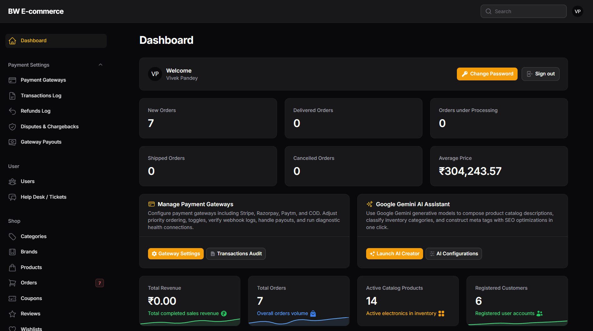
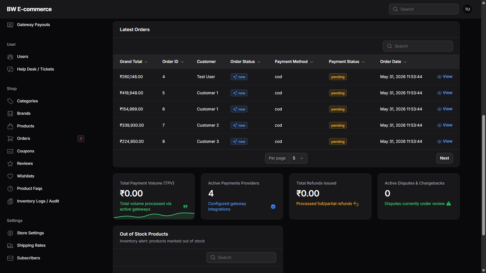

# Laravel-Livewire E-Commerce Application

   

---

### Admin Dashboard Preview




---

## About the Project

This repository showcases a **modern e-commerce application** built with the latest web technologies:

- **Laravel 11**: A robust PHP framework for building scalable web applications.
- **Livewire 3**: A powerful library for building dynamic frontends using server-driven rendering.
- **Filament 3**: An elegant admin panel framework to manage the application backend efficiently.
- **Tailwind CSS**: A utility-first CSS framework for creating responsive and modern UI designs.

### Features

- **Scalable and Maintainable**: Built using the latest version of Laravel for optimal performance and scalability.
- **Dynamic UI**: The frontend is powered by Livewire 3, providing real-time, interactive user experiences.
- **Powerful Admin Panel**: With Filament 3, managing the store's content, orders, and products is seamless.
- **Responsive Design**: Tailwind CSS ensures the application looks great on all screen sizes.
- **Enterprise Payment System**: Decoupled, driver-based payment manager supporting Stripe, Razorpay, Paytm, and Cash on Delivery with automatic fallback routing, webhook verification, dispute logs, and full/partial refund console.

---

## Accessing the Dashboard & Frontend

This project has two separate routing surfaces for users and administrators:

| Page | URL | Description |
| --- | --- | --- |
| **Frontend Home** | `http://127.0.0.1:8000/` | Main customer landing page |
| **Frontend Login** | `http://127.0.0.1:8000/login` | For customers to log in and access order history (redirects to home `/` upon success) |
| **Admin Dashboard (Backend)** | `http://127.0.0.1:8000/admin` | Filament admin dashboard to manage products, categories, orders, etc. |

### Default Login Credentials (Seeded Data)

The database seeding generates a default user and administrator account that can be used to log in:

* **Email:** `test@example.com`
* **Password:** `password`

---

## Getting Started

Follow these instructions to set up and run the project locally.

### Prerequisites

Ensure you have the following installed:

- PHP >= 8.2
- Composer
- Node.js >= 16
- NPM or Yarn
- MySQL (or SQLite)

### Installation

1. **Clone the repository:**
   ```bash
   git clone https://github.com/vickypandey14/E-commerce-using-Laravel-11-Livewire-3-Filament-3-and-Tailwind-CSS.git
   cd E-commerce-using-Laravel-11-Livewire-3-Filament-3-and-Tailwind-CSS
   ```

2. **Install dependencies:**
   ```bash
   composer install
   npm install
   ```

3. **Set up the `.env` file:**
   ```bash
   cp .env.example .env
   ```
   *Note: Open the `.env` file and configure your database settings (e.g. `DB_CONNECTION`, `DB_DATABASE`, `DB_USERNAME`, `DB_PASSWORD`).*

4. **Generate the application key:**
   ```bash
   php artisan key:generate
   ```

5. **Run migrations and seed the database:**
   ```bash
    # Generates all ecommerce tables and populates them with sample users, products, categories, and orders
    php artisan migrate:fresh --seed

    # Seeds the active Stripe, Razorpay, Paytm, and COD gateways with default credentials
    php artisan db:seed --class=PaymentGatewaySeeder
    ```

6. **Build frontend assets:**
   ```bash
   npm run dev
   ```

7. **Start the development server:**
   ```bash
   php artisan serve
   ```

---

## Pages Completed (Frontend)

The following pages have been developed using **Livewire 3**:

1. **Cancel Page**: Displays the order cancellation status.
2. **Success Page**: Confirms successful orders.
3. **Cart Page**: Displays the user's cart items.
4. **Categories Page**: Showcases product categories.
5. **Checkout Page**: Handles the checkout process.
6. **Home Page**: The landing page with featured products and categories.
7. **My Orders Page**: Lists the user's order history.
8. **Order Details Page**: Provides detailed information about a specific order.
9. **Products Page**: Displays all available products.
10. **Product Details Page**: Shows information about a specific product.

---

## Enterprise Payment Architecture

We have introduced a provider-agnostic, driver-based payment management system. All customer transactions are processed dynamically depending on configuration priorities and status flags configured in Filament.

### Key Capabilities
- **Gateway Manager**: Dynamically instantiates drivers based on active database setups.
- **Automated Fallback**: Instantly re-routes checkouts to backup gateways if the primary provider returns API errors or is marked degraded.
- **Audit Logs**: Records request/response transaction payloads under `Payment Settings > Transactions Log`.
- **Refund Console**: Process full or partial refunds directly inside Filament which integrates with Stripe, Razorpay, and Paytm APIs.
- **Sandbox Simulator**: Paytm simulator allows local storefront checkout testing without configuring active API keys.

---

## Google Gemini AI Integration

We have integrated the official Google Gemini REST APIs into the administrative dashboard. This enables automated copy generation, category recommendations, and real-time SEO optimization.

### Key Capabilities
- **Model Registry**: Dynamically fetches the latest content-generation models directly from Google's API endpoints.
- **Copywriter Assistant**: Generates detailed, professional description text for product catalog listings based on item name, category, and brand.
- **Auto Categorizer**: Classifies items and automatically selects the matching category based on name and descriptions.
- **SEO Automator**: Generates optimized Meta Titles and Meta Descriptions in one click.

### How to Access and Configure
1. **Configure Gemini Settings**:
   - Navigate to the Store Settings: `/admin/store-settings`.
   - Scroll down to the **Google Gemini AI Integration** section.
   - Enter your Gemini API Key (obtained from [Google AI Studio](https://aistudio.google.com/)).
   - Click **Verify & Fetch Models** to verify the connection and retrieve available models.
   - Select your preferred model from the **Active AI Model** select dropdown, and save store settings.
2. **Generate Product Descriptions**:
   - Go to `/admin/products/create` or edit an existing product.
   - Type a product name and click the **Generate AI Description** sparkles button beside the *Product Name* field.
3. **Suggest Categories**:
   - Click **AI Suggest Category** sparkles button beside the *Category* selector to dynamically classify the product.
4. **Generate SEO Metadata**:
   - Click **Generate AI SEO** sparkles button beside the *Meta Title* input to populate both meta titles and descriptions automatically.

---

## AI Roadmap

The project aims to explore practical AI integrations within modern Laravel e-commerce applications. Planned AI-powered features include:

* AI-generated product descriptions
* Intelligent product categorization
* Semantic product search
* AI shopping assistant for customer support
* Product recommendation engine
* Automated SEO title and meta description generation
* AI-assisted content moderation for product listings

These features will be implemented using OpenAI APIs and documented as open-source examples to help Laravel developers learn how to integrate AI into production-ready applications.

---

## Testing

Run the following command to execute tests:
```bash
php artisan test
```

---

## Contributing

Contributions are welcome! Please follow these steps:

1. Fork the repository.
2. Create a new branch (`git checkout -b feature-name`).
3. Commit your changes (`git commit -m 'Add feature'`).
4. Push to the branch (`git push origin feature-name`).
5. Open a pull request.

---

## Acknowledgements

Special thanks to [FilamentPHP](https://filamentphp.com/) for building and maintaining an incredibly elegant, developer-friendly, and powerful administration framework that drives the backend operations of this e-commerce platform.

---

## License

This project is open-source and licensed under the [MIT License](LICENSE).

---

## Contact

For any questions or feedback, feel free to reach out:

- **Vivek Chandra Pandey**  
  GitHub: [vickypandey14](https://github.com/vickypandey14)  
  Website: [bytewebster.com](https://bytewebster.com)
